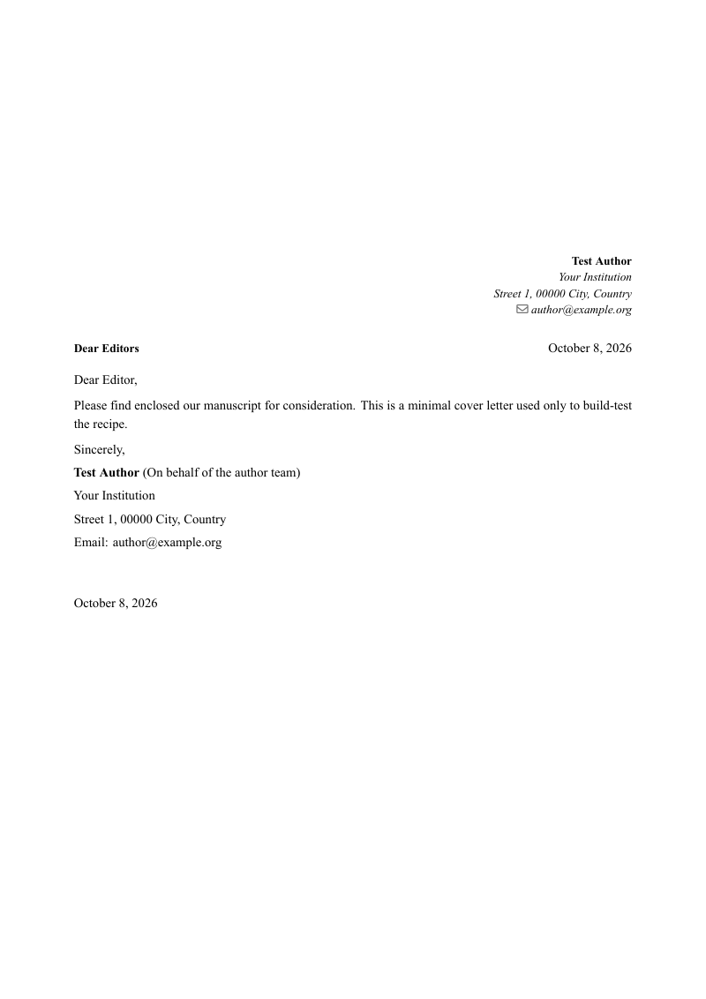

# Cover letter (PDF)

**Produces:** PDF via XeLaTeX (moderncv)

> Preview is a placeholder — replace `preview.png` with a real render of the sample output.

## When to use

Writing a journal cover letter alongside a manuscript.

## Requirements

- **System tools:** pandoc, xelatex, the moderncv LaTeX class (in most TeX distributions)
- **Assets:** resolved automatically from `defaults/cover_letter.yaml` (its `requires` closure of filters/templates). System tools are prompt-only — the plugin never downloads them.

## How to select it in the plugin

Set the note’s `_longform.template` (or the **Run Pandoc Export** step’s preset dropdown) to `cover_letter`. Leave a note’s template blank to fall back to `undefined`.

## Customization

Author identity (institution, address, optional phone and ORCID) is set in `variables:` of `defaults/cover_letter.yaml`. It ships as obvious placeholders (`Your Institution`, …): replace them with your own. These values override the note's frontmatter. Name, email, journal and title come from the project's `metadata.json`, or from the note's frontmatter.

## Personal assets

Your letterhead, signature and reviewer list live in **`PaperBell/pandoc/templates/cover_letter/`** in your vault (or `<your Pandoc assets folder>/templates/cover_letter/`).

- `letterhead.pdf`: blank placeholder. Scaled to `LogoScale` × text width (default 0.80). PDF is best.
- `signature.png`: blank placeholder. Drawn 1 cm tall. Use a transparent-background PNG, cropped tight.
- `reviewers.example.csv`: copy it to `reviewers.csv` (columns `reviewer,email,institute,reason,link`), then set `reviewers: true` in the note.

Point `LogoPath` / `SignaturePath` in the defaults at your own file names rather than overwriting the placeholders. Updating the bundle rewrites the shipped files, including `defaults/cover_letter.yaml`, so keep a copy of your `variables:` block. If an asset file is missing, the letter still builds without it. Full details: `templates/cover_letter/README.md`.

## Attribution

Original to this project unless noted in the repository `NOTICE`.

